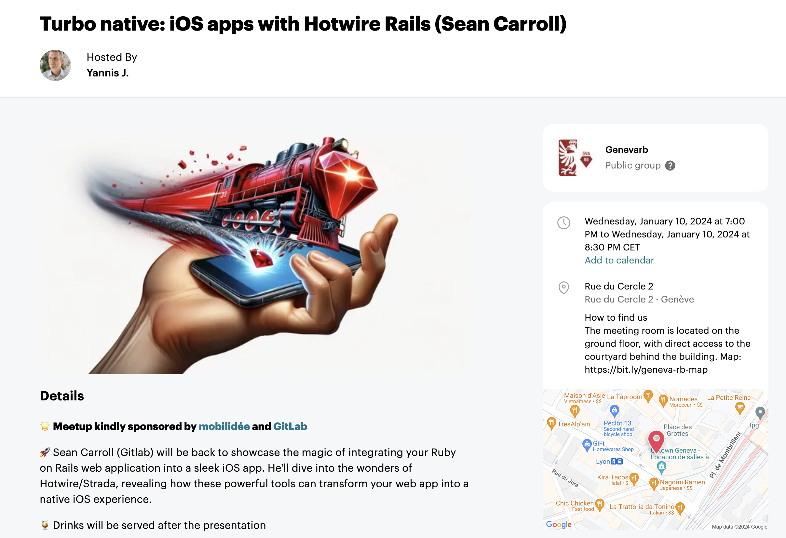

Presented at `geneva.rb`, **The** [Geneva Ruby Meetup](https://www.meetup.com/geneva-rb/events/297635660/), on 10 January 2024. 

## To use this repo

1. Clone the repo
2. In the `rails` folder:
  - yarn
  - bundle install
  - rake db:create:seed
  - bin/dev
3. Open the ios folder in xcode and run

## Presention Notes

### Intro

- I'm not an expert on this, have not yet built a real app and deployed it to the app store
- Have read and played around with many tutorials etc. Some great resources are:
  - [Strada quick start](https://github.com/hotwired/strada-ios/blob/main/docs/QUICK-START.md)
  - [Turbo iOS](https://github.com/hotwired/turbo-ios)
  - [Joe Masilotti's blog](https://masilotti.com/articles/)
  - [Joe Masilotti's Turbo Native Workshop](https://masilotti.com/turbo-native-workshop/)
  - [William Kennedy's blog](https://williamkennedy.ninja/posts/)
  - [The Rails and Hotwire Codex](https://railsandhotwirecodex.com/) (e-book)

### What is Turbo Native and Strada ?

- Turbo ios wraps the iOS Webview in a native app
- Strada bridges native components such as buttons to html / JS
  - already existed before Strada https://github.com/hotwired/turbo-ios/blob/main/Docs/Advanced.md#native---javascript-integration
  - Strada will likely be improved to reduce configuration code
- They are being accepted to the app store, although it is recommended to include some native views
- Once the app is submitted to the app store, it can be changed without a resubmission
- An alternative to ReactNative etc: just code one app and progressively enhance it to be more native.

### My Experiences

- An understanding of how iOS apps are built is needed, you DO need to know how to code a basic iOS app.
- Coming from Rails, Swift and iOS doesn't have the same opinionated approach, so the different tutorials all do it differently. 
- Still a lot of boilerplate and configuration, but this is changing.
- I played around a bit with Android, and it's doable, but not something I would want to do as a Hobby.

